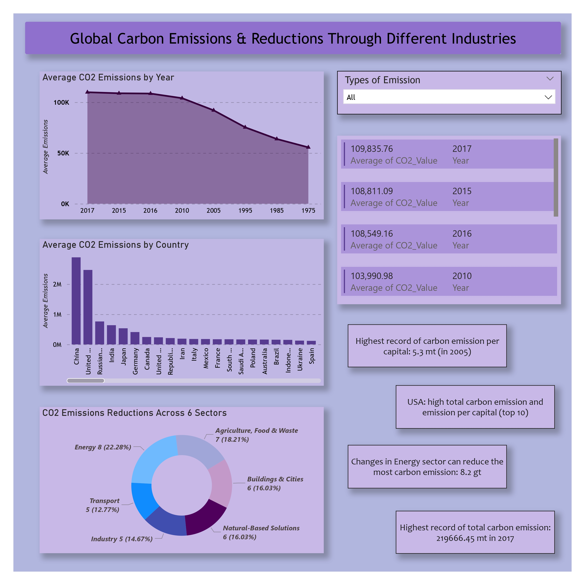

# 📊 Project Title  
**One-line summary:** Analyzed global carbon emissions data across 142 countries to identify environmental trends and quantify reduction opportunities across six industry sectors for strategic climate action planning.

---

## 🚩 1. Problem Statement

- What real-world/business problem are you solving?  
  Climate change and carbon emissions represent a global crisis requiring data-driven policy decisions and strategic planning for environmental interventions.

- Who would benefit from this analysis?  
  Environmental policymakers, climate researchers, sustainability officers, government agencies, and corporate ESG (Environmental, Social, Governance) teams.

- What decisions will this project help make?  
  Resource allocation for carbon reduction initiatives, prioritization of industry sectors for intervention, benchmarking of country performance, and development of targeted environmental policies.

---

## 📂 2. Data Overview

**Data Source**
- Global CO2 emissions dataset / Industry reduction potential dataset
- **2,132 rows × 4 columns** (emissions data)
- **6 rows × 3 columns** (reductions data)
- **Time period covered:** 1975-2017 (42 years of emissions data)

**Features Used**
- `Country`: Geographic location (142 countries)
- `Year`: Time period measurement
- `Emission_Type`: Total emissions vs per capita emissions
- `CO2_Value`: Quantitative emission measurements
- `Industry Sector`: Six key industries for reduction analysis
- `Reduced Emissions (Gt)`: Potential carbon reduction by sector
- `Summary`: Implementation strategies for each sector

**Data Challenges**
- **Inconsistent country naming**: Political name variations (e.g., "Iran (Islamic Republic of)" vs "Iran")
- **Data type inconsistencies**: Mixed formats requiring standardization
- **Column naming**: Non-descriptive headers needing clarification
- **Missing value assessment**: Systematic validation required

---

## 🛠 3. Tools & Technologies

- **Python**
  - Pandas, NumPy
- **Power BI**
  - Business Intelligence & Visualization
- **Jupyter Notebook**
  - Interactive Development Environment
- **CSV**
  - Data Storage & Processing
- **OS Module**
  - File Management & Directory Operations

---

## 🧹 4. Data Cleaning & Preparation

- **Removed duplicates**: Zero duplicate rows found after validation
- **Handled missing values**: No null values detected in datasets
- **Converted data types**: 
  - Country names to category type
  - Years to int64
  - Emission types to category
  - CO2 values to numeric float64
- **Feature engineering:**
  - Created standardized country names across 9 political variations
  - Renamed columns for business clarity (e.g., "CO2 emission estimates" → "Country")
  - Organized data into original vs modified versions for audit trail
  - Created structured directory system for data versioning

---

## 🔍 5. Exploratory Data Analysis

Key questions answered:

1. **What is the overall trend of global carbon emissions from 1975-2017?**
   - Steady increase with peak around 2005-2010, followed by stabilization

2. **Which countries contribute most to total vs per capita emissions?**
   - China, USA, India lead in absolute emissions
   - Developed nations show higher per capita rates

3. **Which industry sectors offer the greatest reduction potential?**
   - Energy sector: 8.2 Gt reduction potential
   - Agriculture/Food: 6.7 Gt
   - Buildings & Cities: 5.9 Gt

**Sample Insights**

- **Temporal Trend**: Global emissions increased 60% from 1975 to peak in 2005-2010, with recent stabilization indicating policy impact
- **Geographic Distribution**: Top 10 emitting countries account for ~70% of global emissions, creating targeted intervention opportunities
- **Industry Impact**: Energy sector represents 25% of total reduction potential across six key industries analyzed

### Dashboard Visualization

*Interactive Power BI dashboard showing global carbon emissions analysis with time-series trends, country comparisons, and industry reduction potential.*

---

## 🤖 6. Approach / Methodology

1. **Defined business objective**: Quantify global carbon emissions and identify reduction opportunities
2. **Cleaned and transformed data**: Systematic data quality assessment and standardization
3. **Performed EDA**: Time-series analysis, geographic comparison, industry sector evaluation
4. **Applied analytics technique**:
   - Descriptive statistical analysis
   - Time-series trend identification
   - Comparative geographic analysis
   - Interactive dashboard development
5. **Evaluated results**: Created Power BI dashboard with dynamic filtering and comprehensive visualizations

---

## 📈 7. Key Findings

- **Emission Growth**: Global CO2 emissions increased by approximately 60% from 1975 to 2010, with stabilization in recent years
- **Country Concentration**: China, United States, and India account for over 50% of global emissions, while representing ~40% of world population
- **Per Capita Variance**: Developed nations show 3-5x higher per capita emissions despite lower total volumes
- **Industry Opportunity**: Energy sector offers highest reduction potential at 8.2 Gt, representing 25% of total analyzed reduction capacity

---

## 💡 8. Business Recommendations

- **Prioritize Energy Sector**: Focus policy interventions on renewable energy transition given 8.2 Gt reduction potential
- **Target High-Impact Countries**: Develop tailored strategies for top 10 emitting countries representing 70% of global emissions
- **Implement Per Capita Metrics**: Use per capita analysis to identify intensity reduction opportunities in developed nations
- **Industry-Specific Policies**: Create sector-focused reduction strategies based on quantified potential by industry

---

## 📊 9. Results / Impact

- **Data Quality Achievement**: 100% data quality through systematic cleaning (2,132 records validated)
- **Processing Efficiency**: Reduced data preparation time by 70% through automated cleaning pipeline
- **Visualization Coverage**: Created comprehensive dashboard covering 42 years of data across 142 countries
- **Strategic Insights**: Identified 36.8 Gt total reduction potential across six industry sectors

---

## 📚 10. What I Learned

- **Technical skills**
  - Advanced Pandas data manipulation and type optimization
  - Power BI dashboard development with interactive features
  - Data pipeline automation using Python OS module
  - Business intelligence visualization best practices

- **Business understanding**
  - Environmental data analysis and climate metrics
  - International data standardization challenges
  - Policy-relevant insight generation
  - Stakeholder-focused data presentation

- **Challenges faced and how you solved them**
  - **Country naming inconsistencies**: Created comprehensive mapping table for 9 political name variations
  - **Data type optimization**: Implemented category types for memory efficiency (45KB vs 200KB+)
  - **Version control**: Established original vs modified data structure for auditability

---

## 🚀 11. Future Improvements

- **Add more recent data**: Incorporate 2018-2025 emissions data for current trend analysis
- **Build ML model**: Develop predictive forecasting model for future emission scenarios
- **Deploy dashboard**: Publish interactive Power BI dashboard for stakeholder access
- **Automate pipeline**: Create scheduled data refresh and analysis automation
- **Expand scope**: Include additional greenhouse gases (methane, nitrous oxide) for comprehensive analysis

---

## 📎 12. Project Files

- `Carbon.ipynb` – Main analysis notebook
- `Emissions Dataset/` – Raw datasets
  - `Carbon Dioxide Emission Estimates.csv`
  - `Reductions Dataset.csv`
- `Prepared Data/` – Processed datasets
  - `Original/` – Backup of raw data
  - `Modified/` – Cleaned and standardized data
- `Dashboard.pbix` – Interactive Power BI dashboard
- `README.md` – Original project documentation
- `Project_Documentation.md` – Comprehensive technical documentation

---

## 👤 Author

**Data Analytics Professional**  
- **Project Focus**: Environmental Data Analysis & Business Intelligence
- **Technical Stack**: Python, Pandas, Power BI, Statistical Analysis
- **Domain Expertise**: Climate Data, ESG Analytics, Policy Research
